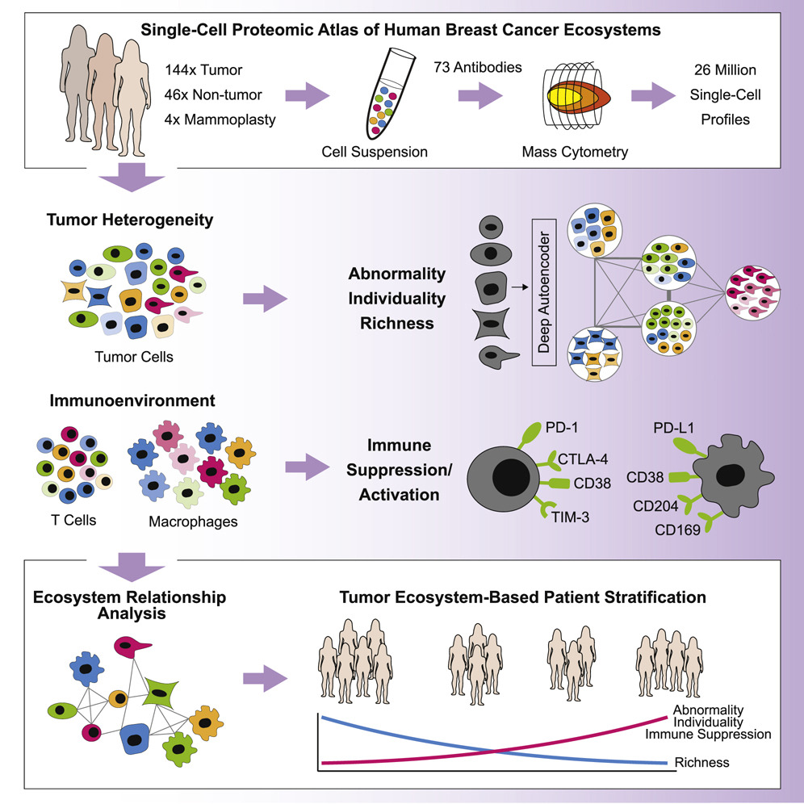
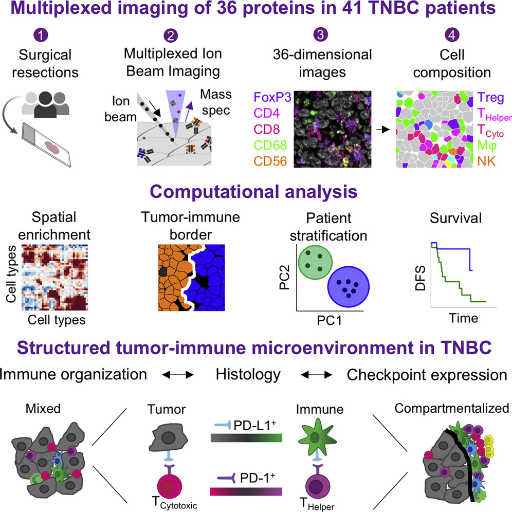
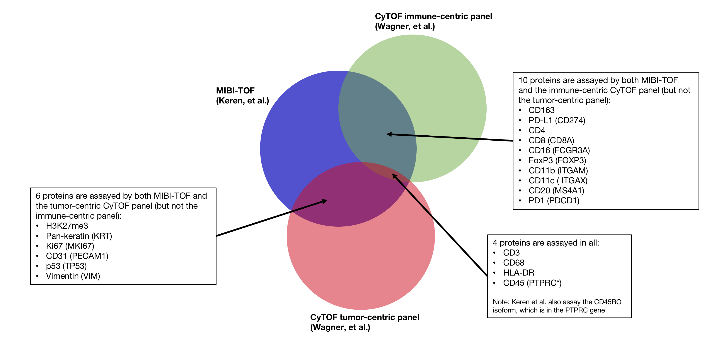

Integrating 'omics datasets across technologies and experiments
================

-   [Background](#background)
    -   [Some questions to consider:](#some-questions-to-consider)
-   [Overview of proteomics technologies](#overview-of-proteomics-technologies)
    -   [1. Mass cytometry (CyTOF)](#mass-cytometry-cytof)
    -   [2. MIBI-TOF](#mibi-tof)
-   [R objects for easy-access to the datasets](#r-objects-for-easy-access-to-the-datasets)
    -   [1. Wagner et al., Mass-Tag CyTOF Breast Cancer Data](#wagner-et-al.-mass-tag-cytof-breast-cancer-data)
        -   [*masstagSCE.rda*](#masstagsce.rda)
        -   [*masstagFS.rda*](#masstagfs.rda)
    -   [2. Keren et al., MIBI-TOF Breast Cancer Data](#keren-et-al.-mibi-tof-breast-cancer-data)
        -   [*mibiSCE.rda*](#mibisce.rda)
-   [References](#references)

Background
==========

Two recent publications have applied single-cell targeted proteomic methods to characterize the breast cancer tumor immune microenvironment. This challenge is about how to approach joint integrative alignment and analysis of single cell proteomics data from different technological platforms and different laboratories.

In "A Single-Cell Atlas of the Tumor and Immune Ecosystem of Human Breast Cancer" Wagner et al. (2019) collected mass cytometry (CyTOF) data on a total of 143 subjects (140 breast cancer, 3 cancer-free; of the 140 breast cancer patients, 6 triple-negative) across 194 samples. A total of 73 proteins were assayed in two panels: an immune-centric and a tumor-centric panel. (Full text available at: <https://www.sciencedirect.com/science/article/pii/S0092867419302673>)

In "A Structured Tumor-Immune Microenvironment in Triple Negative Breast Cancer Revealed by Multiplexed Ion Beam Imaging" Keren et al.(2018) quantified in-situ expression of 36 proteins in 41 triple-negative breast cancer patients. (Full text available at: <https://www.sciencedirect.com/science/article/pii/S0092867418311000>)

 

*Left: Graphical abstract of Wagner et al. 2019; Right: Graphical abstract of Keren et al. 2018*

There are a total of 20 proteins that were assayed in both studies, as illustrated schematically below:



Some questions to consider:
---------------------------

-   How should we approach integrating partially-overlapping proteomic data collected on different patients with similar phenotypes?
-   Without including the spatial x-y coordinate data, how well can we predict cell co-location?
-   Can we predict the spatial expression patterns of proteins measured on mass-tag but not measured in the MIBI-TOF data?
-   Can we integrate other 'omics datasets (e.g., scRNA-seq) to support the results of these proteomic analyses?
-   What additional information can we learn about the different macrophage and immune populations in breast cancer by conducting integrated analyses of these datasets?

Overview of proteomics technologies
===================================

1. Mass cytometry (CyTOF)
-------------------------

Mass cytometry (also: mass-tag, CyTOF) combines flow cytometry with precision of time-of-flight (TOF) mass spectrometry to enable simultaneous quantification of over 40 proteins at single-cell resolution. Instead of conjugating antibody probes with fluorescent labels as in traditional flow cytometry, probes are instead conjugated with metals. The treated cells are then passed into a TOF chamber where the cell itself is ionized, and the quantities of metals indicate the amount of each corresponding probed protein bound prior to ionization. Because the masses of the metals do not have spectral overlap (in contrast to fluorescence imaging, where the size of assay panels is limited by the number of different wavelengths that can be successfully deconvoluted), this approach greatly increases the number of possible channels to measure in a panel.


(Benoist and Hacohen 2011)

To learn more about this technology, we recommend this tutorial presented by Dr. Susanne Heck from the UK NIHR BRC: <https://www.youtube.com/watch?v=eNKMdVMglvI>

2. MIBI-TOF
-----------

The Multiplexed Ion Beam Imaging - Time of Flight (MIBI-TOF) methodology enables researchers to collect molecular data with spatial coordinates. Similar to the approach employed in mass cytometry, antibody probes are conjugated with elemental metals which can be quantified with TOF. Instead of passing the cells through a TOF chamber, with MIBI-TOF the cells are labeled, ionized, and imaged *in situ*.


To learn more about this technology, we recommend this webinar presented by Prof. Michael Angelo, one of the inventors of the MIBI-TOF technology and senior author of this paper: <https://www.youtube.com/watch?v=5DiEyolLiyY>

Image files are available for download from [Ionpath](https://mibi-share.ionpath.com) (requires a free account). There is also an [interactive user interface](https://www.ionpath.com/mibitracker/) for exploring the images by acquisition channel layer.

R objects for easy-access to the datasets
=========================================

We have read and consolidated these data (including clinical features) into R objects for ease of analysis.

These files can be downloaded from this folder: <https://drive.google.com/drive/folders/1vY3ANRIcrrhlwNDr6GLcT_Tk8pd42TU-?usp=sharing>.

Starting by loading relevant packages..

``` r
library(flowCore)
library(readr)
library(SingleCellExperiment)
library(scater)
library(plyr)
library(reshape2)
library(CATALYST)
```

1. Wagner et al., Mass-Tag CyTOF Breast Cancer Data
---------------------------------------------------

Wagner et al. (2019) measured 73 proteins in two panels (immune, tumor) in 194 samples from 143 subjects (140 breast cancer, 3 cancer-free; of the 140 breast cancer patients, 6 triple-negative).

We provide the data in two formats:

-   SingleCellExperiment *masstagSCE.rda* (5 objects, 784.6 MB)
-   flowSet and corresponding dataframes *masstagFS.rda* (13 objects, 828.3 MB)

Both .rda files have multiple objects (livecells, cd45, epith, tcell, myeloid) which contain all live, CD45+, epithelial, T and myeloid cells respectively. (more info below)

Datasets have been normalized (separately by panel), gated for live cells, downsampled for further analysis (where applicable as described above), and clustered (by Phenograph). These objects correspond to the expression data published by the authors at: <https://data.mendeley.com/datasets/gb83sywsjc/1>. At this linke, there are also immunofluorescence images available for download. Full methods including computational workflow are included in the [supplementary materials](https://www.sciencedirect.com/science/article/pii/S0092867419302673#app2).

#### *masstagSCE.rda*

loads 5 SingleCellExperiment objects (cells are in columns, and markers are in rows).

These objects are:

-   Down-sampled cells
    -   **livecells.sce**: all live cells on the tumor and immune panels (only tumor panel measurements included); downsampled to 643,898 cells x 35 proteins
    -   **epith.sce**: epithelial cells identified by presence of markers on the tumor panel; downsampled to 855,914 cells x 35 proteins
    -   **cd45.sce**: CD45+ cells from the live cells; downsampled to 426,872 cells (assayed on immune panel) x 35 proteins
-   Cluster-identified cells
    -   **tcell.sce**: all T-cells (1,114,698 cells x 35 immune markers) identified by *clustering*; drawn from CD45+ after cell-type assignment, prior to downsampling; assayed on immune panel
    -   **myeloid.sce**: myeloid cells (418,519 cells x 35 immune markers) identified by *clustering*; drawn from CD45+ after cell-type assignment, prior to downsampling; assayed on immune panel

A few notes:

-   The set of CD45 cells overlaps to some extent with tcell and myeloid, though neither tcell nor myeloid is a complete subset of CD45 due to the sampling scheme applied to CD45 cells.
-   All of the sets separated by cell type likely have some overlap with livecells, but none are complete subsets (again, due to the sampling scheme.)
-   For all panels, there are some non-protein channels for cisplatin and DNA tags that are included, which is why the protein numbers above do not correspond exactly to the expression matrix dimensions.

As an example, we will examine **cd45.sce**

``` r
load("data/masstagSCE.rda")
cd45.sce
```

    ## class: SingleCellExperiment 
    ## dim: 38 426872 
    ## metadata(0):
    ## assays(1): exprs
    ## rownames(38): CD64 CD38 ... DNA tag 193 dead
    ## rowData names(4): channel_name marker_name marker_class
    ##   hgnc_symbol
    ## colnames: NULL
    ## colData names(31): sample_id condition.x ...
    ##   Neoadjuvant.Therapy.Received Previous.Cancer.Incidences
    ## reducedDimNames(0):
    ## spikeNames(0):

From examining the colData (annotations corresponding to each cell), we can see that that there were 5 donors that we were unable to map to the clinical data at all, and therefore in this dataset they do not have clinical data and we advise dropping them.

(Some patients have incomplete clinical data, either because the data are not applicable, e.g., cancer-related features for healthy donors, or the specific attribute is not available, e.g, specific cancer typing in certain patients. These are lowercase 'na' strings.)

``` r
cd45_to_keep <- which(!is.na(colData(cd45.sce)$Gender))
cd45.sce_dropna <- cd45.sce[,cd45_to_keep]
cd45.sce_dropna
```

    ## class: SingleCellExperiment 
    ## dim: 38 420685 
    ## metadata(0):
    ## assays(1): exprs
    ## rownames(38): CD64 CD38 ... DNA tag 193 dead
    ## rowData names(4): channel_name marker_name marker_class
    ##   hgnc_symbol
    ## colnames: NULL
    ## colData names(31): sample_id condition.x ...
    ##   Neoadjuvant.Therapy.Received Previous.Cancer.Incidences
    ## reducedDimNames(0):
    ## spikeNames(0):

``` r
# To verify there are no (true) NA's left:
sum(is.na(rowData(cd45.sce_dropna)))
```

    ## [1] 0

#### *masstagFS.rda*

This .rda file contains 13 objects that can be analyzed using the CATALYST package. Because CATALYST flowSet objects do not include cell annotation (colData) and feature annotation (rowData), we provide these as dataframes:

-   5 CATALYST flowSets objects: **cd45.fs**, **epith.fs**, **livecells.fs**, **myeloid.fs**, **tcell.fs** corresponding to the same cell population and expression data for the SingleCellExperiment objects above, but in flowSet format instead. We provide these flowSet objects because they include additional channels (e.g., unlabeled channels; cluster assignments) that we dropped in the SingleCellExperiment objects because they are not proteins.
-   5 dataframes with cell and clinical annotation that correspond to each of the flowSets above (same SingleCellExperiment colData above) and can be joined with the flowFrames by filename: **cd45\_md\_merged**, **epith\_md\_merged**, **livecells\_md\_merged**, **myeloid\_md\_merged**, **tcell\_md\_merged**
-   3 dataframes with the protein/marker annotation data (same SingleCellExperiment rowData above):
    -   **immune\_panel**: cd45, myeloid, and tcell
    -   **tumor\_panel**: epithelial (epith)
    -   **livecells\_tumor\_panel**: livecells

As before, we will take a look at the CD45 flowSet:

``` r
load('data/masstagFS.rda')
ls(pattern = "fs")
```

    ## [1] "cd45.fs"      "epith.fs"     "livecells.fs" "myeloid.fs"  
    ## [5] "tcell.fs"

``` r
cd45.fs
```

    ## A flowSet with 194 experiments.
    ## 
    ##   column names:
    ##   cluster Center Event_length Offset Residual Time Width beadDist Y89Di Ru96Di Ru98Di Ru99Di Ru100Di Ru101Di Ru102Di Rh103Di Ru104Di Pd105Di Pd106Di Pd108Di Pd110Di In113Di In115Di Sn120Di Ba138Di La139Di Ce140Di Pr141Di Nd142Di Nd143Di Nd144Di Nd145Di Nd146Di Sm147Di Nd148Di Sm149Di Nd150Di Eu151Di Sm152Di Eu153Di Sm154Di Gd155Di Gd156Di Gd157Di Gd158Di Tb159Di Gd160Di Dy161Di Dy162Di Dy163Di Dy164Di Ho165Di Er166Di Er167Di Er168Di Tm169Di Er170Di Yb171Di Yb172Di Yb173Di Yb174Di Lu175Di Yb176Di Ir191Di Ir193Di Pt194Di Pt195Di Pb208Di Bi209Di

The flowSet is a container for flowFrames, which can be indexed using double brackets:

``` r
head(cd45.fs[[1]])
```

    ##      cluster   Center Event_length   Offset  Residual        Time    Width
    ## [1,]       7 567.2245           15 64.34851 108.83110   9815841.0 27.89222
    ## [2,]      10 413.4472           11 90.54124 129.53735    367975.0 32.28856
    ## [3,]      18 406.3933           13 56.72983  78.60076   4003804.0 20.86787
    ## [4,]       7 333.6920           11 39.46552  57.01842 135520752.0 11.00039
    ## [5,]       9 524.9499           15 48.63354  81.50016    821643.1 18.25102
    ## [6,]       4 477.6843           12 90.81374  21.73505 136893712.0 32.18181
    ##       beadDist     Y89Di   Ru96Di   Ru98Di Ru99Di   Ru100Di   Ru101Di
    ## [1,] 103.23412 0.0000000 0.000000 0.000000      0 0.0000000 0.1075136
    ## [2,]  86.02425 0.0000000 3.599668 0.000000      0 0.0000000 0.0000000
    ## [3,]  87.47730 0.7027172 0.000000 0.000000      0 0.7171045 0.0000000
    ## [4,] 127.44385 2.8670170 0.000000 0.000000      0 0.0000000 0.0000000
    ## [5,]  82.52734 4.5044708 0.000000 1.185571      0 0.0000000 0.0000000
    ## [6,]  93.27676 0.8888627 0.000000 0.000000      0 0.0000000 0.0000000
    ##      Ru102Di    Rh103Di Ru104Di  Pd105Di    Pd106Di   Pd108Di   Pd110Di
    ## [1,]       0  0.3190381       0 0.000000 30.1055622 28.647091  24.60919
    ## [2,]       0  9.9221878       0 6.071480  0.3834889 26.919800  34.92344
    ## [3,]       0  2.4269471       0 0.000000 51.8386803 27.327614  60.37265
    ## [4,]       0 28.2922344       0 0.000000  0.0000000  8.937044  31.88517
    ## [5,]       0  0.0000000       0 0.000000 27.4880352 20.872721  35.44027
    ## [6,]       0 49.1122208       0 1.335442  3.8439596 75.168610 137.30350
    ##           In113Di   In115Di      Sn120Di  Ba138Di      La139Di   Ce140Di
    ## [1,] 0.000000e+00 1.0270343 0.000000e+00 21.73590 0.0000000000 3.6241398
    ## [2,] 0.000000e+00 0.6527977 1.644518e-15 25.80639 0.0000000000 0.0000000
    ## [3,] 8.350634e-15 0.0000000 4.540711e+00 16.31721 0.0000000000 0.0000000
    ## [4,] 6.358031e-01 0.0000000 2.697935e-01 43.52672 3.7008423805 0.1156764
    ## [5,] 0.000000e+00 0.0000000 0.000000e+00 38.33703 0.0002418133 0.4941276
    ## [6,] 0.000000e+00 0.0000000 1.234742e+00 44.37694 2.1331901550 3.3798978
    ##        Pr141Di   Nd142Di    Nd143Di  Nd144Di    Nd145Di   Nd146Di
    ## [1,]  1.768601 0.9630483  0.0000000 0.000000  0.5353031  1.045848
    ## [2,]  2.836057 0.0000000  0.0000000 1.398099  0.0000000 27.157284
    ## [3,] 21.996693 1.6658205 14.1120090 1.497199 13.1786232 17.238659
    ## [4,]  0.000000 2.0586598  4.0997372 0.000000  7.3672423  5.621067
    ## [5,]  0.000000 0.0000000  3.7308216 0.000000 13.8264923  3.325691
    ## [6,]  2.910449 2.8002882  0.9053216 1.666918  3.2545867 10.206876
    ##        Sm147Di   Nd148Di  Sm149Di    Nd150Di  Eu151Di   Sm152Di   Eu153Di
    ## [1,] 0.0000000 4.8879995 0.000000  0.0000000  0.00000 0.0000000  6.045513
    ## [2,] 0.8295452 0.0000000 0.000000  0.0000000 12.10871 0.0000000  3.392641
    ## [3,] 0.8289149 0.0000000 8.125792 11.3564377 21.56535 1.8026096 11.408743
    ## [4,] 0.0000000 0.0000000 1.249753  1.1428437  2.67189 0.0000000  0.000000
    ## [5,] 0.0000000 0.0000000 3.483759  0.0000000  0.00000 0.0000000  4.354061
    ## [6,] 1.8844620 0.1903211 0.000000  0.1882362  0.00000 0.2439357  8.290735
    ##         Sm154Di   Gd155Di     Gd156Di   Gd157Di  Gd158Di     Tb159Di
    ## [1,] 4.68375158 0.0000000   0.0000000 0.0000000 0.000000   0.8142838
    ## [2,] 0.00000000 0.0000000   0.0000000 0.0000000 0.000000   0.0000000
    ## [3,] 4.82803583 0.0000000 233.6519775 0.0000000 2.957641 109.6659470
    ## [4,] 0.09058827 4.5876184   0.0000000 0.6454852 0.000000   0.0000000
    ## [5,] 0.00000000 0.1943192   0.0000000 0.0000000 0.000000   3.2803254
    ## [6,] 3.47196126 0.0000000   0.8500204 0.0000000 0.000000   8.3393269
    ##         Gd160Di   Dy161Di     Dy162Di    Dy163Di   Dy164Di     Ho165Di
    ## [1,]  0.2523632 0.2557701 0.003382295 2.95142961  0.000000  60.3264885
    ## [2,]  0.0000000 0.0000000 0.167070732 0.00000000 23.603401   0.0000000
    ## [3,] 14.8226376 0.8301169 8.269689560 0.05941971  0.000000  22.5389862
    ## [4,]  1.0778399 0.0000000 2.063319683 4.99500895  1.521681 262.7178345
    ## [5,]  1.6358972 0.0000000 0.000000000 3.11479926 34.113018   0.1223667
    ## [6,]  2.2135849 0.0000000 0.713938177 0.66682643  7.666898   0.1785165
    ##        Er166Di Er167Di    Er168Di   Tm169Di  Er170Di  Yb171Di  Yb172Di
    ## [1,]  0.000000       0   0.000000 0.0000000 0.000000  0.00000 0.000000
    ## [2,]  1.416259       0   0.000000 0.0000000 0.000000  0.00000 0.000000
    ## [3,] 31.209564       0 187.678696 0.7752261 0.000000 18.19749 0.000000
    ## [4,]  0.000000       0   1.109076 0.0000000 0.000000  0.00000 0.000000
    ## [5,]  0.000000       0   0.000000 0.0000000 0.583447  0.00000 0.000000
    ## [6,] 13.123400       0   2.167748 0.0000000 0.000000  0.00000 8.214861
    ##        Yb173Di    Yb174Di    Lu175Di  Yb176Di   Ir191Di   Ir193Di
    ## [1,] 107.34358  0.0000000  0.0000000 660.1575 255.14378 338.47720
    ## [2,]   0.00000  0.0000000  0.0000000 411.4382  50.45397 126.45631
    ## [3,]   0.00000 65.5315094  1.4218583 809.2799 574.63837 953.35602
    ## [4,] 161.38608  0.9153448  0.5491524 733.4113  50.51385  74.51775
    ## [5,] 249.33560  0.0000000  0.0000000 998.1643 246.57608 363.60504
    ## [6,]  26.13642  1.2173078 47.8207092 224.5526  90.13052 208.90724
    ##        Pt194Di   Pt195Di   Pb208Di   Bi209Di
    ## [1,]  84.03944  63.85899 12.915708  68.67842
    ## [2,]  93.21510 103.66292 28.531092  35.23617
    ## [3,]  73.72333  46.57275  4.338331 126.98807
    ## [4,]   6.58650  12.87391 20.378185  59.96667
    ## [5,] 125.57738 113.79084 16.913794  24.42424
    ## [6,] 149.63991 183.58800 13.342813 126.48129

The elemental tag names in the "name" field correspond to the **fcs\_colname** field in each panel dataframe.

``` r
head(immune_panel)
```

    ## # A tibble: 6 x 4
    ##   fcs_colname antigen Clone  hgnc_symbol
    ##   <chr>       <chr>   <chr>  <chr>      
    ## 1 Pr141Di     CD64    10.1   FCGR1A     
    ## 2 Nd142Di     CD38    HIT2   CD38       
    ## 3 Nd143Di     CD68    Y1/82A CD68       
    ## 4 Nd144Di     CD36    5-271  CD36       
    ## 5 Nd145Di     CD197   G043H7 CCR7       
    ## 6 Nd146Di     CD45RA  HI100  CD45RA

2. Keren et al., MIBI-TOF Breast Cancer Data
--------------------------------------------

#### *mibiSCE.rda*

Keren et al. (2018) quantified in-situ expression of 36 proteins in 41 triple-negative breast cancer patients. We provide **mibi.sce** as a SingleCellExperiment object. (1 object with expression matrix dimensions 49 rows x 201,656 columns and additional row/column annotations; 27.1 MB)

Expression values are acquired by quantifying intensity of each of the cells, and normalized by cell size. Cell boundaries are determined using an adaptation of DeepCell, a CNN approach for image segmentation. The size-normalized raw intensity values are then arcsinh transformed and standardized across the markers. We begin with these transformed and standardized values, which were provided directly by the author. The code and procedure for generating these data are provided in supplementary materials of the paper (Keren et al. 2018).

In addition to the raw image files already available for download from [Ionpath](https://mibi-share.ionpath.com), these expression matrices which were provided to us directly, along with labeled matrix .tiff files, and will be made directly available from the [Angelo lab website](https://www.angelolab.com/blank-2) soon.

``` r
load('data/mibiSCE.rda')
mibi.sce
```

    ## class: SingleCellExperiment 
    ## dim: 49 201656 
    ## metadata(0):
    ## assays(1): mibi_exprs
    ## rownames(49): C Na ... Ta Au
    ## rowData names(4): channel_name is_protein hgnc_symbol
    ##   wagner_overlap
    ## colnames: NULL
    ## colData names(36): SampleID cellLabelInImage ...
    ##   Survival_days_capped_2016.1.1 Censored
    ## reducedDimNames(0):
    ## spikeNames(0):

Rows correspond to channels and columns correspond to cells. We can see all of the channels that were collected in this experiment:

``` r
rownames(mibi.sce)
```

    ##  [1] "C"            "Na"           "Si"           "P"           
    ##  [5] "Ca"           "Fe"           "dsDNA"        "Vimentin"    
    ##  [9] "SMA"          "Background"   "B7H3"         "FoxP3"       
    ## [13] "Lag3"         "CD4"          "CD16"         "CD56"        
    ## [17] "OX40"         "PD1"          "CD31"         "PD-L1"       
    ## [21] "EGFR"         "Ki67"         "CD209"        "CD11c"       
    ## [25] "CD138"        "CD163"        "CD68"         "CSF-1R"      
    ## [29] "CD8"          "CD3"          "IDO"          "Keratin17"   
    ## [33] "CD63"         "CD45RO"       "CD20"         "p53"         
    ## [37] "Beta catenin" "HLA-DR"       "CD11b"        "CD45"        
    ## [41] "H3K9ac"       "Pan-Keratin"  "H3K27me3"     "phospho-S6"  
    ## [45] "MPO"          "Keratin6"     "HLA_Class_1"  "Ta"          
    ## [49] "Au"

A total of 49 channels were measured. 38 of these correspond to protein measurements. The other 11 comprise background, experimental controls (e.g, Au and dsDNA), and elements of potential interest in studying cellular mechanisms (e.g., Ca, Fe; relevant in other spatial studies, for instance, as discussed in Michael Angelo's webinar linked above).

Annotation fields *is\_protein*, *hgnc\_symbol*, *wagner\_overlap* in rowData are helpful in subsetting and joining data.

``` r
tail(rowData(mibi.sce))
```

    ## DataFrame with 6 rows and 4 columns
    ##             channel_name is_protein hgnc_symbol wagner_overlap
    ##              <character>  <numeric> <character>    <character>
    ## phospho-S6    phospho-S6          1  phospho-S6             no
    ## MPO                  MPO          1         MPO             no
    ## Keratin6        Keratin6          1       KRT6A             no
    ## HLA_Class_1  HLA_Class_1          1 HLA_Class_1             no
    ## Ta                    Ta          0          na             na
    ## Au                    Au          0          na             na

The 38 proteins can be easily identified by using the binary attribute is\_protein from rowData:

``` r
proteins = rowData(mibi.sce)$is_protein==1
sum(proteins)
```

    ## [1] 38

``` r
mibi.sce_proteins <- mibi.sce[which(proteins),]
mibi.sce_proteins
```

    ## class: SingleCellExperiment 
    ## dim: 38 201656 
    ## metadata(0):
    ## assays(1): mibi_exprs
    ## rownames(38): Vimentin B7H3 ... Keratin6 HLA_Class_1
    ## rowData names(4): channel_name is_protein hgnc_symbol
    ##   wagner_overlap
    ## colnames: NULL
    ## colData names(36): SampleID cellLabelInImage ...
    ##   Survival_days_capped_2016.1.1 Censored
    ## reducedDimNames(0):
    ## spikeNames(0):

``` r
rownames(mibi.sce_proteins)
```

    ##  [1] "Vimentin"     "B7H3"         "FoxP3"        "Lag3"        
    ##  [5] "CD4"          "CD16"         "CD56"         "OX40"        
    ##  [9] "PD1"          "CD31"         "PD-L1"        "EGFR"        
    ## [13] "Ki67"         "CD209"        "CD11c"        "CD138"       
    ## [17] "CD163"        "CD68"         "CSF-1R"       "CD8"         
    ## [21] "CD3"          "IDO"          "Keratin17"    "CD63"        
    ## [25] "CD45RO"       "CD20"         "p53"          "Beta catenin"
    ## [29] "HLA-DR"       "CD11b"        "CD45"         "H3K9ac"      
    ## [33] "Pan-Keratin"  "H3K27me3"     "phospho-S6"   "MPO"         
    ## [37] "Keratin6"     "HLA_Class_1"

As far as possible, HGNC gene names for proteins are available in the rowData columns *hgnc\_symbol*. Measurements that are not proteins are *na*. The overlap with the proteins assayed in Wagner, et al. are stored in rowData as *wagner\_overlap* (na, no, tumor, immune, tumor+immune).

Similarly, there are 36 columns of single cell annotations for the 201,656 cells that can be accessed in *colData*.

``` r
dim(colData(mibi.sce))
```

    ## [1] 201656     36

``` r
colnames(colData(mibi.sce))
```

    ##  [1] "SampleID"                      "cellLabelInImage"             
    ##  [3] "cellSize"                      "tumorYN"                      
    ##  [5] "tumorCluster"                  "immuneCluster"                
    ##  [7] "tumor_group"                   "immune_group"                 
    ##  [9] "DONOR_NO"                      "YEAR"                         
    ## [11] "ANON_ID_ONCOSHARE"             "AGE_AT_DX"                    
    ## [13] "YEARDX"                        "STAGE"                        
    ## [15] "SITE_02"                       "LATERAL"                      
    ## [17] "GRADE"                         "TCODE_P"                      
    ## [19] "NCODE_P"                       "MCODE_P"                      
    ## [21] "AJCC_P"                        "ER"                           
    ## [23] "PR"                            "HER2NEU"                      
    ## [25] "CS_TUM_SIZE"                   "RESULT_GENE_1"                
    ## [27] "RESULT_MUTATION_1"             "TEST_OFFERING_1"              
    ## [29] "RESULT_GENE_2"                 "RESULT_MUTATION_2"            
    ## [31] "TEST_OFFERING_2"               "MYRIAD_TEST_RESULT"           
    ## [33] "RECURRENCE_LABEL"              "TIL_score"                    
    ## [35] "Survival_days_capped_2016.1.1" "Censored"

Cell type information is availble in the columns *tumor\_group* and *immune\_group*

51% of cells were Keratin positive tumor cells and 41% of cells were immune cells.

``` r
# Tumor Cells
round(table(mibi.sce$tumor_group)/ncol(mibi.sce),2)
```

    ## 
    ##            Endothelial                 Immune Keratin-positive tumor 
    ##                   0.01                   0.41                   0.51 
    ##       Mesenchymal-like                  Tumor           Unidentified 
    ##                   0.04                   0.02                   0.01

Among the immune cell population, macrophages and CD8, CD4+ T-cells and other immune cells were identified. 10% of all cells assayed were macrophages

``` r
# Immune Cells
round(table(mibi.sce$immune_group)/ncol(mibi.sce),2)
```

    ## 
    ##            B          CD3          CD4          CD8           DC 
    ##         0.05         0.02         0.06         0.08         0.01 
    ##      DC/Mono  Macrophages     Mono/Neu  Neutrophils           NK 
    ##         0.03         0.10         0.02         0.01         0.00 
    ##   not immune Other immune        Tregs 
    ##         0.59         0.03         0.01

These fields can be used to subset by cell and/or sample characteristic. E.g., below we subset only for the 83,336 cells identified as immune.

``` r
immune_inds <- which(mibi.sce$tumor_group == "Immune")
mibi.sce_immune <- mibi.sce[,immune_inds]
mibi.sce_immune
```

    ## class: SingleCellExperiment 
    ## dim: 49 83336 
    ## metadata(0):
    ## assays(1): mibi_exprs
    ## rownames(49): C Na ... Ta Au
    ## rowData names(4): channel_name is_protein hgnc_symbol
    ##   wagner_overlap
    ## colnames: NULL
    ## colData names(36): SampleID cellLabelInImage ...
    ##   Survival_days_capped_2016.1.1 Censored
    ## reducedDimNames(0):
    ## spikeNames(0):

Using this, we can analyze within donor immune cells. For instance, we can examine the distribution of immune cell types counts by donor:

``` r
table(mibi.sce_immune$immune_group, mibi.sce_immune$DONOR_NO)
```

    ##               
    ##                30732 30734 30738 30739 30740 30742 30744 30753 30754 30762
    ##   B                0     6     0    17     0   516   146    96     0     3
    ##   CD3              4    21     5    85     1   193   130    52     0    19
    ##   CD4             13    19    25    22     0   809  2404   537     0    29
    ##   CD8              8    51     8   475     0   584  2433   701     1    61
    ##   DC               2     0     0     0     1     6   240     0     0     0
    ##   DC/Mono          9     4    40    17     0   133   256   234     0    27
    ##   Macrophages    211   312    61   193   103   578   494  1413    72   467
    ##   Mono/Neu        58    46    41   203     4    81     9    29     0    30
    ##   Neutrophils    165    18    15   478     1   114    92   150    14    11
    ##   NK              10     0     1     0     0    17   212    11     0    19
    ##   Other immune    67    12    20    65     4    70    35    52     4    49
    ##   Tregs            3    11     6     2     0   153    48   272     0     4
    ##               
    ##                30765 30766 30770 30771 30781 30782 30783 30785 30786 30789
    ##   B                0     0   209     0    18     1    60  2257     2     0
    ##   CD3             30    35   354     3    75    34   229    29     1    52
    ##   CD4             33    72   466     5   165   118   340  1230     2    65
    ##   CD8             33   410  2089     0   410   302   391   192     1   784
    ##   DC               0     0    14     0     2     0    73    72     0     3
    ##   DC/Mono         39    21   172     2    99    17   212   163    11   212
    ##   Macrophages    438   345  1088    32  1304   574  1236   324   166   428
    ##   Mono/Neu       141    85    59     5   414   214   163    10     4   105
    ##   Neutrophils     18    45    82    31    77   212   119    56     5     8
    ##   NK               6     4    42     0    26     1     6   118     9     4
    ##   Other immune    88    28   303     6   233    22   384    35     7    86
    ##   Tregs            0     5   285     4    43   122    59    17     0    13
    ##               
    ##                30799 30805 30812 30818 30821 30823 30824 30827 30838 30846
    ##   B              177     2   427     4     5   238  1147  2623   329     8
    ##   CD3            276    11   223    96     8   421   304   206   369    37
    ##   CD4            263    21   491   130     9   340   243  2723   733     4
    ##   CD8            284   245   496   370   178   979   173   770   304    50
    ##   DC               0    37    36     5     0     1     2     3     2     0
    ##   DC/Mono        416     9   434   105    15   298   176   416   458    18
    ##   Macrophages    507   511   726   409   394   945   281   164   880   269
    ##   Mono/Neu       216    56    21     5    44    68     3     1    52    53
    ##   Neutrophils    119    10    19    70   284    30    10     8   129     8
    ##   NK              17    11    12    11     0    13     6     8     6     0
    ##   Other immune   569    43   273   218   372  1332   213   109   717   114
    ##   Tregs            0     0    21     0     0     8     0     0   182     0
    ##               
    ##                30847 30851 30853 30854 30860 30865 30866 30868
    ##   B               33    40   703     0     0     3     3    41
    ##   CD3            133   127    61     1     0   121    11    57
    ##   CD4            121    95   205     1     2   255    14   389
    ##   CD8            206   553   255     4     6   531    38  1273
    ##   DC               0     4   729     0     0     3     9     0
    ##   DC/Mono        198    82   100     2     9   333    44   178
    ##   Macrophages    710   893   113   245   272  1064   152  1410
    ##   Mono/Neu       467    81    14     7     3   183     2    39
    ##   Neutrophils     13   146    12   288    15    73     4    60
    ##   NK               0    10    30     0     0     1     0    63
    ##   Other immune   436   372   248    10     9   175    38    26
    ##   Tregs            3     0    16     0     0    48     0    15

References
==========

Benoist, Christophe, and Nir Hacohen. 2011. “Flow Cytometry, Amped up.” *Science* 332 (6030). American Association for the Advancement of Science: 677–78. doi:[10.1126/science.1206351](https://doi.org/10.1126/science.1206351).

Keren, Leeat, Marc Bosse, Diana Marquez, Roshan Angoshtari, Samir Jain, Sushama Varma, Soo-Ryum Yang, et al. 2018. “A Structured Tumor-Immune Microenvironment in Triple Negative Breast Cancer Revealed by Multiplexed Ion Beam Imaging.” *Cell* 174 (6): 1373–1387.e19. doi:[10.1016/j.cell.2018.08.039](https://doi.org/10.1016/j.cell.2018.08.039).

Wagner, Johanna, Maria Anna Rapsomaniki, Stéphane Chevrier, Tobias Anzeneder, Claus Langwieder, August Dykgers, Martin Rees, et al. 2019. “A Single-Cell Atlas of the Tumor and Immune Ecosystem of Human Breast Cancer.” *Cell* 177 (5): 1330–1345.e18. doi:[10.1016/j.cell.2019.03.005](https://doi.org/10.1016/j.cell.2019.03.005).
