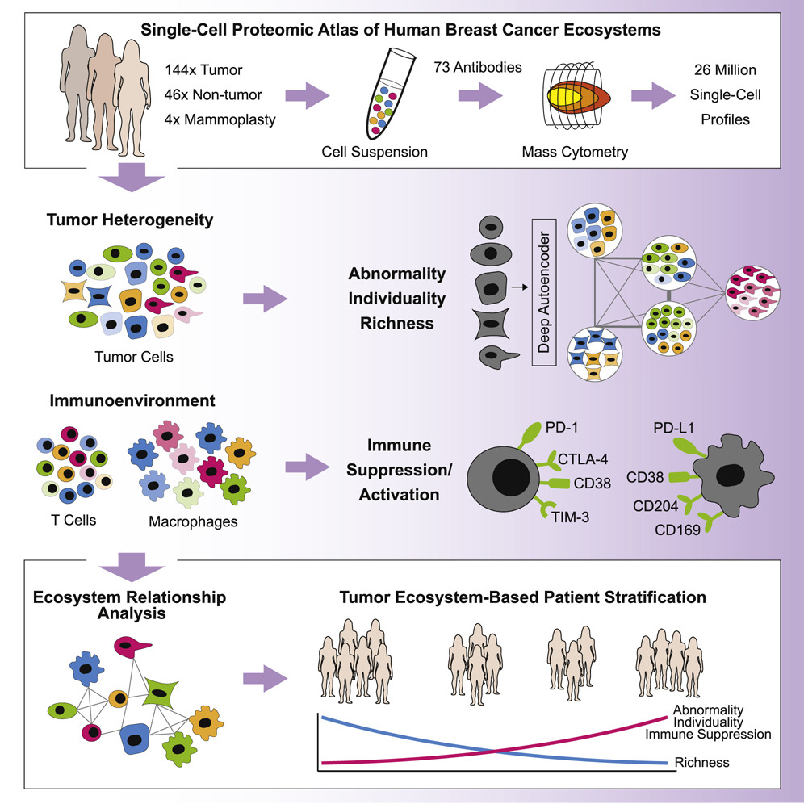
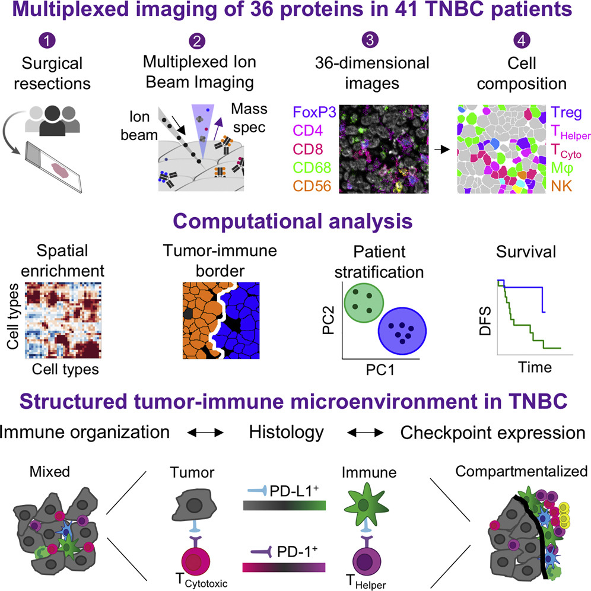

```{r setup, include=FALSE}
knitr::opts_chunk$set(echo = TRUE)
```

# Background

Two recent publications have applied single-cell targeted proteomic methods to characterize the breast cancer tumor immune microenvironment. This challenge is about how to approach joint integrative alignment and analysis of single cell proteomics data from different technological platforms and different laboratories.

In "A Single-Cell Atlas of the Tumor and Immune Ecosystem of Human Breast Cancer" Wagner et al. [-@Wagner2019-db] collected mass cytometry (CyTOF) data on a total of 143 subjects (140 breast cancer, 3 cancer-free; of the 140 breast cancer patients, 6 triple-negative) across 194 samples. A total of 73 proteins were assayed in two panels: an immune-centric and a tumor-centric panel. (Full text available at: https://www.sciencedirect.com/science/article/pii/S0092867419302673)

In "A Structured Tumor-Immune Microenvironment in Triple Negative Breast Cancer Revealed by Multiplexed Ion Beam Imaging" Keren et al.[-@Keren2018-kf] quantified in-situ expression of 36 proteins in 41 triple-negative breast cancer patients. (Full text available at: https://www.sciencedirect.com/science/article/pii/S0092867418311000)

{width=400px}         {width=400px}

*Left: Graphical abstract of Wagner et al. 2019; Right: Graphical abstract of Keren et al. 2018*

There are a total of 20 proteins that were assayed in both studies, as illustrated schematically below:

{width=800px}


## Some questions to consider:

* How should we approach integrating partially-overlapping proteomic data collected on different patients with similar phenotypes?
* Without including the spatial x-y coordinate data, how well can we predict cell co-location?
* Can we predict the spatial expression patterns of proteins measured on mass-tag but not measured in the MIBI-TOF data?
* Can we integrate other 'omics datasets (e.g., scRNA-seq) to support the results of these proteomic analyses?
* What additional information can we learn about the different macrophage and immune populations in breast cancer by conducting integrated analyses of these datasets?


# Overview of proteomics technologies

## 1. Mass cytometry (CyTOF)

Mass cytometry (also: mass-tag, CyTOF) combines flow cytometry with precision of time-of-flight (TOF) mass spectrometry to enable simultaneous quantification of over 40 proteins at single-cell resolution. Instead of conjugating antibody probes with fluorescent labels as in traditional flow cytometry, probes are instead conjugated with metals. The treated cells are then passed into a TOF chamber where the cell itself is ionized, and the quantities of metals indicate the amount of each corresponding probed protein bound prior to ionization. Because the masses of the metals do not have spectral overlap (in contrast to fluorescence imaging, where the size of assay panels is limited by the number of different wavelengths that can be successfully deconvoluted), this approach greatly increases the number of possible channels to measure in a panel.

{width=400px}

[@Benoist677]

To learn more about this technology, we recommend this tutorial presented by Dr. Susanne Heck from the UK NIHR BRC: https://www.youtube.com/watch?v=eNKMdVMglvI

## 2. MIBI-TOF

The Multiplexed Ion Beam Imaging - Time of Flight (MIBI-TOF) methodology enables researchers to collect molecular data with spatial coordinates. Similar to the approach employed in mass cytometry, antibody probes are conjugated with elemental metals which can be quantified with TOF. Instead of passing the cells through a TOF chamber, with MIBI-TOF the cells are labeled, ionized, and imaged *in situ*.

{width=800px}

To learn more about this technology, we recommend this webinar presented by Prof. Michael Angelo, one of the inventors of the MIBI-TOF technology and senior author of this paper: https://www.youtube.com/watch?v=5DiEyolLiyY

Image files are available for download from [Ionpath](https://mibi-share.ionpath.com) (requires a free account). There is also an [interactive user interface](https://www.ionpath.com/mibitracker/) for exploring the images by acquisition channel layer.


# R objects for easy-access to the datasets

We have read and consolidated these data (including clinical features) into R objects for ease of analysis.

These files can be downloaded from this folder: https://drive.google.com/drive/folders/1vY3ANRIcrrhlwNDr6GLcT_Tk8pd42TU-?usp=sharing.

Starting by loading relevant packages..
```{r message = FALSE}

library(flowCore)
library(readr)
library(SingleCellExperiment)
library(scater)
library(plyr)
library(reshape2)
library(CATALYST)
```


## 1. Wagner et al., Mass-Tag CyTOF Breast Cancer Data
Wagner et al. [-@Wagner2019-db] measured 73 proteins in two panels (immune, tumor) in 194 samples from 143 subjects (140 breast cancer, 3 cancer-free; of the 140 breast cancer patients, 6 triple-negative). 

We provide the data in two formats:

- SingleCellExperiment *masstagSCE.rda* (5 objects, 784.6 MB)
- flowSet and corresponding dataframes *masstagFS.rda* (13 objects, 828.3 MB)

Both .rda files have multiple objects (livecells, cd45, epith, tcell, myeloid) which contain all live, CD45+, epithelial, T and myeloid cells respectively. (more info below)

Datasets have been normalized (separately by panel), gated for live cells, downsampled for further analysis (where applicable as described above), and clustered (by Phenograph). These objects correspond to the expression data published by the authors at: https://data.mendeley.com/datasets/gb83sywsjc/1. At this linke, there are also immunofluorescence images available for download. Full methods including computational workflow are included in the [supplementary materials](https://www.sciencedirect.com/science/article/pii/S0092867419302673#app2).

#####  *masstagSCE.rda* 
loads 5 SingleCellExperiment objects (cells are in columns, and markers are in rows).

These objects are:

- Down-sampled cells
    - **livecells.sce**: all live cells on the tumor and immune panels (only tumor panel measurements included); downsampled to 643,898 cells x 35 proteins
    - **epith.sce**: epithelial cells identified by presence of markers on the tumor panel; downsampled to 855,914 cells x 35 proteins
    - **cd45.sce**: CD45+ cells from the live cells; downsampled to 426,872 cells (assayed on immune panel) x 35 proteins
- Cluster-identified cells
    - **tcell.sce**: all T-cells (1,114,698 cells x 35 immune markers) identified by *clustering*; drawn from CD45+ after cell-type assignment, prior to downsampling; assayed on immune panel
    - **myeloid.sce**: myeloid cells (418,519 cells x 35 immune markers) identified by *clustering*; drawn from CD45+ after cell-type assignment, prior to downsampling; assayed on immune panel

A few notes:

- The set of CD45 cells overlaps to some extent with tcell and myeloid, though neither tcell nor myeloid is a complete subset of CD45 due to the sampling scheme applied to CD45 cells.
- All of the sets separated by cell type likely have some overlap with livecells, but none are complete subsets (again, due to the sampling scheme.)
- For all panels, there are some non-protein channels for cisplatin and DNA tags that are included, which is why the protein numbers above do not correspond exactly to the expression matrix dimensions.

As an example, we will examine **cd45.sce**

```{r}
load("data/masstagSCE.rda")
cd45.sce
```

From examining the colData (annotations corresponding to each cell), we can see that that there were 5 donors that we were unable to map to the clinical data at all, and therefore in this dataset they do not have clinical data and we advise dropping them.

(Some patients have incomplete clinical data, either because the data are not applicable, e.g., cancer-related features for healthy donors, or the specific attribute is not available, e.g, specific cancer typing in certain patients. These are lowercase 'na' strings.)

```{r}
cd45_to_keep <- which(!is.na(colData(cd45.sce)$Gender))
cd45.sce_dropna <- cd45.sce[,cd45_to_keep]
cd45.sce_dropna

# To verify there are no (true) NA's left:
sum(is.na(rowData(cd45.sce_dropna)))
```


#####  *masstagFS.rda* 
This .rda file contains 13 objects that can be analyzed using the CATALYST package. Because CATALYST flowSet objects do not include cell annotation (colData) and feature annotation (rowData), we provide these as dataframes:

- 5 CATALYST flowSets objects: **cd45.fs**, **epith.fs**, **livecells.fs**, **myeloid.fs**, **tcell.fs** corresponding to the same cell population and expression data  for the SingleCellExperiment objects above, but in flowSet format instead. We provide these flowSet objects because they include additional channels (e.g., unlabeled channels; cluster assignments) that we dropped in the SingleCellExperiment objects because they are not proteins.
- 5 dataframes with cell and clinical annotation that correspond to each of the flowSets above (same SingleCellExperiment colData above) and can be joined with the flowFrames by filename: **cd45_md_merged**, **epith_md_merged**, **livecells_md_merged**, **myeloid_md_merged**, **tcell_md_merged**
- 3 dataframes with the protein/marker annotation data (same SingleCellExperiment rowData above):
    - **immune_panel**: cd45, myeloid, and tcell
    - **tumor_panel**: epithelial (epith)
    - **livecells_tumor_panel**: livecells

As before, we will take a look at the CD45 flowSet:

```{r message = FALSE}
load('data/masstagFS.rda')
ls(pattern = "fs")
cd45.fs
```

The flowSet is a container for flowFrames, which can be indexed using double brackets:

```{r}
head(cd45.fs[[1]])
```

The elemental tag names in the "name" field correspond to the **fcs_colname** field in each panel dataframe. 

```{r}
head(immune_panel)
```


## 2. Keren et al., MIBI-TOF Breast Cancer Data 

#####  *mibiSCE.rda* 

Keren et al. [-@Keren2018-kf] quantified in-situ expression of 36 proteins in 41 triple-negative breast cancer patients. We provide **mibi.sce** as a SingleCellExperiment object. (1 object with expression matrix dimensions 49 rows x 201,656 columns and additional row/column annotations; 27.1 MB)

Expression values are acquired by quantifying intensity of each of the cells, and normalized by cell size. Cell boundaries are determined using an adaptation of DeepCell, a CNN approach for image segmentation. 
The size-normalized raw intensity values are then arcsinh transformed and standardized across the markers. We begin with these transformed and standardized values, which were provided directly by the author. The code and procedure for generating these data are provided in supplementary materials of the paper [@Keren2018-kf].

In addition to the raw image files already available for download from [Ionpath](https://mibi-share.ionpath.com), these expression matrices which were provided to us directly, along with labeled matrix .tiff files, and will be made directly available from the [Angelo lab website](https://www.angelolab.com/blank-2) soon.

```{r message = FALSE}
load('data/mibiSCE.rda')
mibi.sce
```

Rows correspond to channels and columns correspond to cells.
We can see all of the channels that were collected in this experiment:

```{r}
rownames(mibi.sce)
```


A total of 49 channels were measured. 38 of these correspond to protein measurements. The other 11 comprise background, experimental controls (e.g, Au and dsDNA), and elements of potential interest in studying cellular mechanisms (e.g., Ca, Fe; relevant in other spatial studies, for instance, as discussed in Michael Angelo's webinar linked above). 

Annotation fields *is_protein*, *hgnc_symbol*, *wagner_overlap* in rowData are helpful in subsetting and joining data.  

```{r}
tail(rowData(mibi.sce))
```

The 38 proteins can be easily identified by using the binary attribute is_protein from rowData:

```{r}
proteins = rowData(mibi.sce)$is_protein==1
sum(proteins)

mibi.sce_proteins <- mibi.sce[which(proteins),]
mibi.sce_proteins
rownames(mibi.sce_proteins)
```


As far as possible, HGNC gene names for proteins are available in the rowData columns *hgnc_symbol*.  Measurements that are not proteins are *na*. The overlap with the proteins assayed in Wagner, et al. are stored in rowData as *wagner_overlap* (na, no, tumor, immune, tumor+immune).

Similarly, there are 36 columns of single cell annotations for the 201,656 cells that can be accessed in *colData*.

```{r}
dim(colData(mibi.sce))
colnames(colData(mibi.sce))
```

Cell type information is availble in the columns *tumor_group* and *immune_group* 

51% of cells were Keratin positive tumor cells and 41% of cells were immune cells.

```{r}
# Tumor Cells
round(table(mibi.sce$tumor_group)/ncol(mibi.sce),2)
```

Among the immune cell population, macrophages and CD8, CD4+ T-cells and other immune cells were identified.  10% of all cells assayed were macrophages

```{r}
# Immune Cells
round(table(mibi.sce$immune_group)/ncol(mibi.sce),2)
```

These fields can be used to subset by cell and/or sample characteristic. E.g., below we subset only for the 83,336 cells identified as immune.

```{r}
immune_inds <- which(mibi.sce$tumor_group == "Immune")
mibi.sce_immune <- mibi.sce[,immune_inds]
mibi.sce_immune
```

Using this, we can analyze within donor immune cells. For instance, we can examine the distribution of immune cell types counts by donor:

```{r}
table(mibi.sce_immune$immune_group, mibi.sce_immune$DONOR_NO)
```


#References


