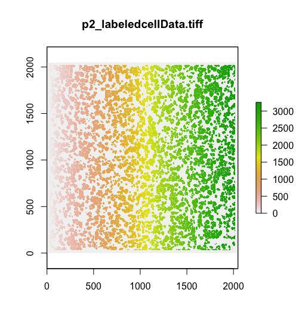

raster can be used to access the coordinate labels
--------------------------------------------------

Download and unzip the full spatial data files from here:
<a href="https://www.angelolab.com/mibi-data" class="uri">https://www.angelolab.com/mibi-data</a>

``` r
PATH <- '~/Desktop/dfci research/BIRS/mibitof/'
IMG <- 'TNBC_shareCellData/p2_labeledcellData.tiff'

setwd(PATH)

library(raster)
```

In the *TNBC\_shareCellData* there are 41 image files, each
corresponding to one patient. Within those image files, there is a
matrix layer containing the ID of a particular cell for that patient,
which corresponds to the *cellLabelInImage*. This can be used to link the 
proteomic measurements with location.

The .tiff files can be saved into raster objects:

``` r
ras_obj <- raster(IMG)
ras_obj
```

    ## class      : RasterLayer 
    ## dimensions : 2048, 2048, 4194304  (nrow, ncol, ncell)
    ## resolution : 1, 1  (x, y)
    ## extent     : 0, 2048, 0, 2048  (xmin, xmax, ymin, ymax)
    ## crs        : NA 
    ## source     : /Users/laurenhsu/Desktop/dfci research/BIRS/mibitof/TNBC_shareCellData/p2_labeledcellData.tiff 
    ## names      : p2_labeledcellData 
    ## values     : 0, 65535  (min, max)

``` r
plot(ras_obj, main = strsplit(IMG,'/')[[1]][2])
```



The raster object can be accessed like a matrix. Each of the values in
the 2000 by 2000 matrix indicates the cell lable for that location in
the image.

For example, if we zoom into the pixels in the middle of the image, we
can see that cell 2395 is in the middle:

``` r
ras_obj[1500:1510,1500:1510]
```

    ##   [1] 2395 2395 2395 2395 2395 2395 2395 2395 2395 2395 2395 2395 2395 2395 2395
    ##  [16] 2395 2395 2395 2395 2395 2395 2395 2395 2395 2395 2395 2395 2395 2395 2395
    ##  [31] 2395 2395 2395 2395 2395 2395 2395 2395 2395 2395 2395 2395 2395 2395 2395
    ##  [46] 2395 2395 2395 2395 2395 2395 2395 2395 2395 2395 2395 2395 2395 2395 2395
    ##  [61] 2395 2395 2395 2395 2395 2395 2395 2395 2395 2395 2395 2395 2395 2395 2395
    ##  [76] 2395 2395 2395 2395 2395 2395 2395 2395 2395 2395 2395 2395 2395 2395 2395
    ##  [91] 2395 2395 2395 2395 2395 2395 2395 2395 2395 2395 2395 2395 2395 2395 2395
    ## [106] 2395 2395 2395 2395 2395 2395 2395 2395 2395 2395 2395 2395 2395 2395 2395
    ## [121] 2395

The raster object can also be converted easily into a matrix:

``` r
space_mat <- as.matrix(ras_obj)
space_mat[1530:1510,1530:1510]
```

    ##       [,1] [,2] [,3] [,4] [,5] [,6] [,7] [,8] [,9] [,10] [,11] [,12] [,13]
    ##  [1,] 2423 2423 2423 2423 2423 2423 2423 2423 2423  2423  2423  2423  2423
    ##  [2,] 2423 2423 2423 2423 2423 2423 2423 2423 2423  2423  2423  2423  2423
    ##  [3,] 2423 2423 2423 2423 2423 2423 2423 2423 2423  2423  2423  2423  2423
    ##  [4,] 2423 2423 2423 2423 2423 2423 2423 2423 2423  2423  2423  2423  2423
    ##  [5,]    0 2423 2423 2423 2423 2423 2423 2423 2423  2423  2423  2423  2423
    ##  [6,]    0    0 2423 2423 2423 2423 2423 2423 2423  2423  2423  2423  2423
    ##  [7,]    1    0    0 2423 2423 2423 2423 2423 2423  2423  2423  2423  2423
    ##  [8,]    1    1    0    0 2423 2423 2423 2423 2423  2423  2423  2423  2423
    ##  [9,]    1    1    1    0    0 2423 2423 2423 2423  2423  2423  2423  2423
    ## [10,]    1    1    1    1    0    0    0 2423 2423  2423  2423  2423  2423
    ## [11,]    1    1    1    1    1    1    0    0 2423  2423  2423  2423  2423
    ## [12,]    1    1    1    1    1    1    1    0    0     0  2423     0     0
    ## [13,]    1    1    1    1    1    1    1    1    1     0     0     0  2395
    ## [14,]    1    1    1    1    1    1    1    1    1     1     1     0  2395
    ## [15,]    1    1    1    1    1    1    1    1    1     1     0     0  2395
    ## [16,]    1    1    1    1    1    1    1    1    1     1     0  2395  2395
    ## [17,]    1    1    1    1    1    1    1    1    1     1     0  2395  2395
    ## [18,]    1    1    1    1    1    1    1    1    1     1     0  2395  2395
    ## [19,]    1    1    1    1    1    1    1    1    1     1     0  2395  2395
    ## [20,]    1    1    1    1    1    1    1    1    1     1     0  2395  2395
    ## [21,]    1    1    1    1    1    1    1    1    1     1     0  2395  2395
    ##       [,14] [,15] [,16] [,17] [,18] [,19] [,20] [,21]
    ##  [1,]  2423  2423  2423  2423  2423  2423  2423  2423
    ##  [2,]  2423  2423  2423  2423  2423  2423  2423  2423
    ##  [3,]  2423  2423  2423  2423  2423  2423  2423  2423
    ##  [4,]  2423  2423  2423  2423  2423  2423  2423  2423
    ##  [5,]  2423  2423  2423  2423  2423  2423  2423  2423
    ##  [6,]  2423  2423  2423  2423  2423  2423     0     0
    ##  [7,]  2423  2423  2423  2423     0     0     0  2395
    ##  [8,]  2423  2423  2423     0     0  2395  2395  2395
    ##  [9,]  2423  2423     0     0  2395  2395  2395  2395
    ## [10,]  2423  2423     0  2395  2395  2395  2395  2395
    ## [11,]     0     0     0  2395  2395  2395  2395  2395
    ## [12,]     0  2395  2395  2395  2395  2395  2395  2395
    ## [13,]  2395  2395  2395  2395  2395  2395  2395  2395
    ## [14,]  2395  2395  2395  2395  2395  2395  2395  2395
    ## [15,]  2395  2395  2395  2395  2395  2395  2395  2395
    ## [16,]  2395  2395  2395  2395  2395  2395  2395  2395
    ## [17,]  2395  2395  2395  2395  2395  2395  2395  2395
    ## [18,]  2395  2395  2395  2395  2395  2395  2395  2395
    ## [19,]  2395  2395  2395  2395  2395  2395  2395  2395
    ## [20,]  2395  2395  2395  2395  2395  2395  2395  2395
    ## [21,]  2395  2395  2395  2395  2395  2395  2395  2395

We can see that moving a bit up and to the right brings us to the border
between cell 2395, cell 2423, and some background noise (0; 1)

Visit the [raster documentation page](https://rspatial.org/raster/spatial/8-rastermanip.html) at [R spatial](https://rspatial.org/raster/) to learn more.
