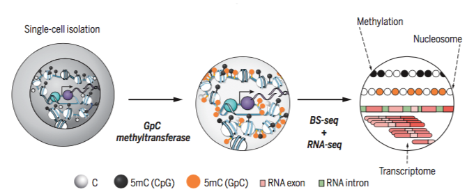

# Background 
This study focuses on emerging assays that combine transcriptome and epigenome profiles from the same single cell, as well as the application of data integration methods to uncover the correlation structure between information from these datasets and to understand the coordination between epigenetic and transcriptomics layers in developmental and disease cell biology. Epigenomics sequencing methodologies are still at their infancy for single cells. We will analyse a set of data from the novel technology scNMT-seq to study mouse gastrulation.




## Key article

Argelaguet *et al.* 2019 is available at  https://www.biorxiv.org/content/10.1101/519207v1. (A more recent version of the paper is provided). 


# Data

## Overview

The study includes 826 cells matching  across all data sets (transcriptome, DNA accessibility and DNA methylation) after quality control and filtering. 


## Download
All processed and original data and scripts used to pre-process are avilable in here: https://cloudstor.aarnet.edu.au/plus/s/Xzf5vCgAEUVgbfQ  
The contained files are described below.  
Detailed guidelines are available in `scNMT-seq_guidelines` file in this folder, please have a look as we provide example of code to extract the data, and list several challenges, and give words of caution!


## Easy data
Easy data can be downloaded from [CloudStor](relocate gitignore to toplevel - ignore all dot files) in the `output/` folder or from the direct link: https://cloudstor.aarnet.edu.au/plus/s/Xzf5vCgAEUVgbfQ?path=%2Foutput  
The description of the files can be found in below.

## Data directories

The [CloudStor folder](https://cloudstor.aarnet.edu.au/plus/s/Xzf5vCgAEUVgbfQ) structure is as follows:

### ./output

processed transcriptome and epigenome files containing:

#### ./output/scnmtseq_gastrulation_mae_826-cells_orderedFeatures.rds

A `MultiAssayExperiment` object containing:

```r
A MultiAssayExperiment object of 13 listed
 experiments with user-defined names and respective classes. 
 Containing an ExperimentList class object of length 13: 
 [1] rna: matrix with 18345 rows and 826 columns  ## normlaised expression
 [2] met_genebody: matrix with 15837 rows and 826 columns  ## context DNA methylation rate
 [3] met_promoter: matrix with 12092 rows and 826 columns  ## context DNA methylation rate
 [4] met_cgi: matrix with 5536 rows and 826 columns  ## context DNA methylation rate
 [5] met_p300: matrix with 101 rows and 826 columns  ## context DNA methylation rate
 [6] met_CTCF: matrix with 175 rows and 826 columns  ## context DNA methylation rate
 [7] met_DHS: matrix with 66 rows and 826 columns  ## context DNA methylation rate
 [8] acc_genebody: matrix with 17139 rows and 826 columns  ## context DNA accessibility rate
 [9] acc_promoter: matrix with 16518 rows and 826 columns  ## context DNA accessibility rate
 [10] acc_cgi: matrix with 4459 rows and 826 columns  ## context DNA accessibility rate
 [11] acc_p300: matrix with 138 rows and 826 columns  ## context DNA accessibility rate
 [12] acc_CTCF: matrix with 898 rows and 826 columns  ## context DNA accessibility rate
 [13] acc_DHS: matrix with 290 rows and 826 columns  ## context DNA accessibility rate


Features: 
 experiments() - obtain the ExperimentList instance 
 colData() - the primary/phenotype DataFrame 
 sampleMap() - the sample availability DataFrame 
 `$`, `[`, `[[` - extract colData columns, subset, or experiment 
 *Format() - convert into a long or wide DataFrame 
 assays() - convert ExperimentList to a SimpleList of matrices
```


#### ./output/met_dt_list.rds

a list of `data.table` class objects containing methylation data - filtered by a minimum of 3 calls per site and cell-detection of >= 400

each dataset contains a data.table with 6 columns. Below is a snapshot:

```r
$ id_met   <chr> : sample id in the dataset matching that of metadata  
$ id       <chr> : feature id  
$ anno     <chr> : annotation (identical for a given annotation)  
$ Nmet     <int> : Number of calls supporting CpG methylation  
$ N        <int> : Total number of calls in the region  
$ rate     <dbl> : Rate of methylation calculated using a binomial model with beta(1, 1) prior  
$ cell_cov <int> : Number of cells having at least 3 calls in the region for the feature id  
$ wij      <dbl> : Weight of observation at feature id for cell j (id_met) calculated using SE(rate)  
$ rbar     <dbl> : weighted mean of methylation rate across all cells for feature id  
$ n_i      <dbl> : weighted sum of observations across all cells for feature id  
$ vhat     <dbl> : weighted variance of methylation rate at feature id for all cells  
$ lci      <dbl> : lower bound of vhat 95% confidence interval  
```

#### ./output/macc_dt_list.rds

a list of `data.table` class objects containing chromatin accessibility data - filtered by a minimum of 3 calls per site and cell-detection of >= 500


each dataset contains a data.table with 6 columns. Below is a snapshot:

```r
$ id_acc   <chr> : sample id in the dataset matching that of metadata  
$ id       <chr> : feature id  
$ anno     <chr> : annotation (identical for a given annotation)  
$ Nacc     <int> : Number of calls supporting chromatin accessibility  
$ N        <int> : Total number of calls in the region  
$ rate     <dbl> : Rate of accessibility calculated using a binomial model with beta(1, 1) prior  
$ cell_cov <int> : Number of cells having at least 3 calls in the region for the feature id  
$ wij      <dbl> : Weight of observation at feature id for cell j (id_acc) calculated using SE(rate)  
$ rbar     <dbl> : weighted mean of accessibility rate across all cells for feature id  
$ n_i      <dbl> : weighted sum of observations across all cells for feature id  
$ vhat     <dbl> : weighted variance of accessibility rate at feature id for all cells  
$ lci      <dbl> : lower bound of vhat 95% confidence interval  
```

### ./output/sample-metadata_matching-cells.txt

sample metadata for matching cells across omics


### ./data

original input data before pre-processing:

#### ./data/met/parsed

tsv files for each annotation with columns containing:

```r
$ V1 <chr> "E4.5-5.5_new_Plate1_A02", "E4.5-5.…   ## sample annotation id  
$ V2 <chr> "ESC_p300_10004", "ESC_p300_10005",…   ## feature id  
$ V3 <chr> "ESC_p300", "ESC_p300", "ESC_p300",…   ## annotation  
$ V4 <int> 0, 1, 0, 0, 1, 0, 1, 0, 0, 0, 0, 0,…   ## Number of calls methylated  
$ V5 <int> 1, 4, 1, 2, 6, 5, 1, 2, 2, 1, 1, 3,…   ## Total calls  
$ V6 <int> 0, 25, 0, 0, 17, 0, 100, 0, 0, 0, 0…   ## Proportion of calls methylated  
```
#### ./data/acc/parsed

tsv files for each annotation with columns:

```r
$ V1 <chr> "E4.5-5.5_new_Plate1_A02", "E4.5-5.…   ## sample annotation id  
$ V2 <chr> "ESC_p300_10004", "ESC_p300_10005",…   ## feature id  
$ V3 <chr> "ESC_p300", "ESC_p300", "ESC_p300",…   ## annotation  
$ V4 <int> 0, 1, 0, 0, 1, 0, 1, 0, 0, 0, 0, 0,…   ## Number of detected accessible loci  
$ V5 <int> 1, 4, 1, 2, 6, 5, 1, 2, 2, 1, 1, 3,…   ## Total calls  
$ V6 <int> 0, 25, 0, 0, 17, 0, 100, 0, 0, 0, 0…   ## Proportion of loci accessible  
```

#### ./data/rna/parsed

Expression data in `SingleCellExperiment` class with counts and nroamlised logcounts.

#### ./data/sample_metadata.txt

Original sample metadata for all cells (including non-matching ones)

### ./notebook

In `./notebook/preprocessing.Rmd`, a preprocessing file which reproduces `./output` files from `./data` files.

### ./src

Utility functions used for preprocessing.


