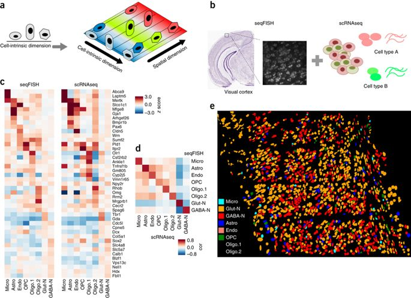

# Background

This study integrates sequencing and imaging-based single-cell transcriptomic profiling methods.
The authors showed that incorportation of scRNAseq data improved cell type mapping over using seqFISH data analysis alone, 
while including the seqFISH data enabled the identification of spatial structure in the scRNAseq data (Figure from Zhu *et al* 2018). For our workshop, we focus on a subset of these data that contain matched seqFISH and scRNAseq data for the adult mouse visual cortex.



## Key articles 

Zhu *et al* 2018, reference paper for seqFISH is available at: (https://www.nature.com/articles/nbt.4260)

Tasic *et al* 2016, reference paper for scRNAseq is available at: (https://www.nature.com/articles/nn.4216)

# Data

## Overview

The dataset includes 1,597 single cells from adult mouse visual cortex and 125 genes mapped with seqFISH from Zhu *et al* 2018 and scRNA-seq data for ~1,600 cells from Tasic *et al* 2016 in the primary visual cortex in adult male mice. These combined data enable cell type mapping with spatial information in the adult mouse visual cortex.  

### Main challenge: 

The main goal of the multi-omics analysis for this data in the workshop is methods to enhance the molecular resolution of spatial molecular data by integrating seqFISH and scRNA-seq data. For example, types of questions or challenges that can be addressed computationally include: 

* Can scRNA-seq data be overlaid onto seqFISH for resolution enhancement?
* What is the minimal number of genes needed for data integration?
* Are there signatures of cellular co-localization or spatial coordinates in non-spatial scRNA-seq data?

## Download 

All original and processed data and scripts used to pre-process are available on [Dropbox](https://www.dropbox.com/sh/avj4nrd4la5i88u/AACafWwBbE-xsLvOGDwRZDpYa?dl=0). The core processed data are described in the **Easy data** section below. 
Extra downloads options available on the spatial data [bitbucket page](https://bitbucket.org/qzhu/smfish-hmrf/src/master/)
The orginal scRNAseq count matrix can be downloaded from [GEO](https://www.ncbi.nlm.nih.gov/geo/query/acc.cgi?acc=GSE71585).

## Easy data 

Easy data link to find files for this project: (https://www.dropbox.com/sh/avj4nrd4la5i88u/AACafWwBbE-xsLvOGDwRZDpYa?dl=0)

## Data directories

The following files contain cross-platform noramlized expression for matched genes between both datasets used for spatial domain identification and SVM prediction in Zhu *et al* 2018.

#### /tasic_training_b2.txt 

txt file of normalized scRNAseq data for `113 genes x 1723 cells`

```r
        V2 V3 V4 V5 V6
abca15  11 42 17 42 35
abca9   22 46 22 46 39
acta2   15 47 15 42 34
adcy4   12 45 12 45 38
aldh3b2 27 49 27 49 42
```

#### /seqfish_cortex_b2_testing.txt 

txt file of normalized seqFISH data for `113 genes x 1597 cells`

```r
         V2 V3 V4 V5  V6
abca15   68 49 50 39  31
abca9    41 42 38 36  47
acta2    25 23 16 21  29
adcy4    39 54 37 18  37
aldh3b2 101 47 41 52 101
```

#### /seqfish_labels.tsv

tsv file of spatial cluster labels and SVM learned cell types for seqFISH

Fields (tab-delimited): 

1. Cell ID

2. Spatial cluster

3. Cell type class

4. ID of cell type class

5. (irrelevant)

6. Probability of the highest probability class

```r
     V1 V2                   V3 V4 V5        V6
1     1  5 Glutamatergic Neuron  3  - 0.9827927
2     2  5 Glutamatergic Neuron  3  - 0.9445903
3     3  5 Glutamatergic Neuron  3  - 0.8299232
4     4  5 Glutamatergic Neuron  3  - 0.4659458
5     5  5 Glutamatergic Neuron  3  - 0.9863798
````

#### /tasic_labels.tsv

tsv file of cell type labels for scRNAseq

```r
                      V1                             V2      V3
1              Astrocyte      Calb2_tdTpositive_cell_46   upper
2              Astrocyte      Calb2_tdTpositive_cell_48   upper
3              Astrocyte      Calb2_tdTpositive_cell_50   lower
4              Astrocyte      Calb2_tdTpositive_cell_53   lower
5              Astrocyte      Calb2_tdTpositive_cell_58   lower
```

### Additional files 

#### /fcortex.coordinates.txt 

Spatial cell coordinates

#### /hmrf-usage/data/fcortex.gene.ALL.txt 

z-scored matrix incorporating the spatial gene expression of 69 genes

